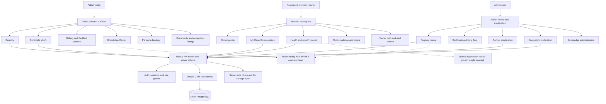
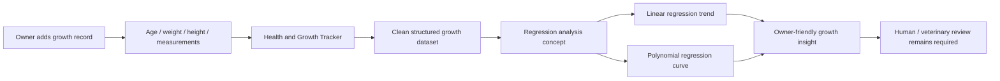
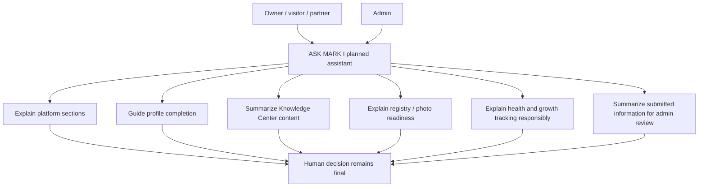
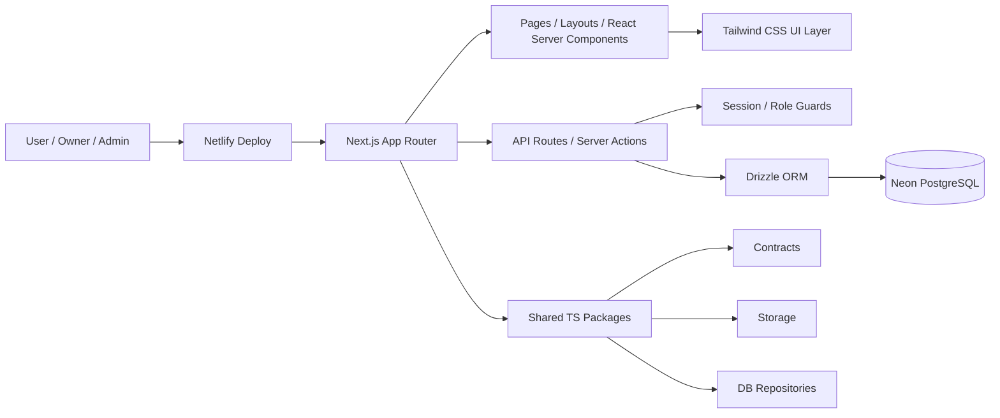
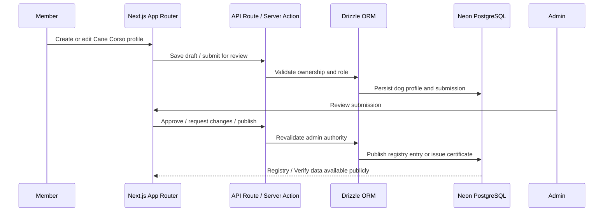
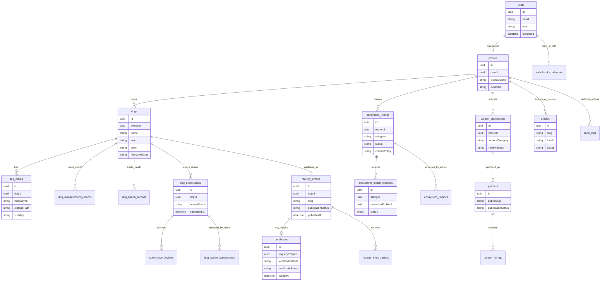

# SoftUni Capstone Project Submission — Cane Corso Platform

This file is prepared for the SoftUni **Full Stack Apps with AI** Capstone Project submission.

The main product documentation remains in [`README.md`](./README.md). This SoftUni README does not replace the product identity of the application. It summarizes how the existing **Cane Corso Platform — USG / Unico Suo Genere** covers the Capstone requirements and gives evaluators a direct path for reviewing the project.

---

## Submission Information

| Field | Value |
| --- | --- |
| Project | Cane Corso Platform — USG / Unico Suo Genere |
| Author | Stefan A. Tananov |
| Email | s.tananov@yahoo.com |
| GitHub Repository | https://github.com/SATananov/cane-corso-platform |
| Live Project URL | https://cane-corso-platform.netlify.app/ |

## Demo Credentials

Use these verified demo accounts to test the deployed Netlify application:

| Role | Email | Password | Purpose |
| --- | --- | --- | --- |
| Member/User | `softuni-user@demo.cane-corso.local` | `SoftuniDemo2026!` | Member dashboard, profile, My Cane Corso, owner journey, dog records, health/growth archive |
| Admin | `softuni-admin@demo.cane-corso.local` | `SoftuniDemo2026!` | Admin review, registry moderation, certificates, partners, ecosystem moderation, knowledge administration |

A separate partner login is not required for the final assessment. The partner flow can be demonstrated from the member/user account and reviewed from the admin account.

For local database preparation, the repository also contains the SoftUni demo seed command:

```powershell
pnpm demo:seed:softuni
```

Demo public routes prepared by the seed include:

```txt
/registry/ares-softuni-demo
/verify/USG-SOFTUNI-DEMO-113
/partners/softuni-partner
/community/softuni-partner-cane-corso-training-transport
```

---

## Reviewer Quick Start

Recommended review flow for the evaluator:

1. Open the live project URL: `https://cane-corso-platform.netlify.app/`.
2. Review the public surfaces: `/`, `/registry`, `/verify`, `/gallery`, `/community`, `/partners`, `/knowledge`, `/faq`.
3. Sign in as **Member/User** with the demo credentials.
4. Review `/member`, `/profile`, `/my-dogs`, `/my-dogs/new`, owner guidance, health/growth records, and moderated ecosystem flows.
5. Sign out and sign in as **Admin** with the demo credentials.
6. Review `/review`, `/admin/registry`, `/admin/partners`, `/admin/ecosystem`, `/admin/knowledge`, and admin-only moderation/authority boundaries.
7. Inspect the GitHub repository: monorepo structure, Next.js API routes, Expo app, Drizzle schema/migrations, seed scripts, QA scripts, and `AGENTS.md`.
8. If running locally, use `pnpm install`, `pnpm db:migrate`, `pnpm demo:seed:softuni`, `pnpm dev`, then run the QA commands listed below.

### Suggested live routes to check

| Area | Route | What it demonstrates |
| --- | --- | --- |
| Public entry | `/` | Premium platform entry and navigation |
| Registry | `/registry` | Public registry surface |
| Registry detail | `/registry/ares-softuni-demo` | Published dog profile demo route when seed data is present |
| Verify | `/verify` and `/verify/USG-SOFTUNI-DEMO-113` | Certificate verification flow |
| Gallery | `/gallery` | Curated public showcase |
| Community | `/community` | Intent-first moderated ecosystem hub |
| Partners | `/partners` and `/partners/softuni-partner` | Partner/service discovery |
| Knowledge | `/knowledge` | Educational content surface |
| Member dashboard | `/member` | Authenticated owner/member experience |
| My Cane Corso | `/my-dogs` | Owner dog profile management |
| Admin review | `/review` | Admin decision console |
| Admin ecosystem | `/admin/ecosystem` | Moderation and match-request review |
| Admin partners | `/admin/partners` | Partner review/publishing controls |
| Runtime DB check | `/api/health/db` | Production database target and runtime status |

---

## Project Summary

Cane Corso Platform is a full-stack, multi-platform application for Cane Corso owners, public visitors, partners, and admins.

The platform provides:

- public Cane Corso Registry;
- public USG Certificate / Verify flow;
- curated Gallery and Certified Archive;
- member dashboard and owner profile;
- My Cane Corso profile management;
- pedigree, health, measurement, and photo-readiness records;
- moderated community and ecosystem listings;
- partner/service directory;
- admin review, moderation, certificate, registry, partner, ecosystem, and knowledge controls;
- educational Knowledge area for Cane Corso ownership, breed identity, structure, care, and platform trust rules;
- Expo mobile client connected to the same Next.js API surface.

The application is product-oriented, but it is also suitable as a SoftUni Capstone project because it demonstrates a real-world full-stack architecture with web, backend, mobile, database, authentication, roles, deployment, AI-assisted development workflow, and documentation.

---


## Visual Product Evidence Map

The diagram below summarizes what the project already contains and how the main product surfaces connect to the full-stack architecture. It is included here so the SoftUni evaluator can quickly see the real platform scope, not only read a feature list.



**Legend:** solid arrows describe implemented platform flows; dotted arrows describe bonus or future-ready AI directions built on top of existing modules and data foundations.

---
## Personal Motivation

My love for the Cane Corso breed is the reason I started learning software development at SoftUni about two years ago. I wanted to gain the skills needed to build a real platform dedicated to this breed — not just a small demo application, but a complete ecosystem for Cane Corso owners, profiles, registry, knowledge, health tracking, partners, certificates, community features, and future AI assistance.

This Capstone Project is an important step toward that long-term vision: creating something unique and focused entirely on Cane Corso. The project will continue to grow after the course assessment. My intention is to keep integrating the new things I learn — better architecture, better user experience, stronger data handling, AI/ML concepts, mobile improvements, automation, and production-readiness practices — whenever they add real value to the platform.

---

## Bonus AI / ML and Future AI Assistant Direction

The core submission already covers the full-stack Capstone requirements. In addition, the project is prepared for future AI-oriented extensions that connect naturally to the Cane Corso domain and to the existing platform modules.

### Regression-Based Growth Insight

The **Owner Health & Growth Tracker** creates a natural foundation for a regression-based ML extension. The idea is to analyze owner-submitted Cane Corso growth records such as age, weight, height, body length, chest circumference, head length, muzzle length, and related measurements.

A simple linear regression model can be used to show basic growth tendencies, while polynomial regression can later model a more realistic growth curve. This can help demonstrate how machine learning may support owner awareness, growth tracking, and future product intelligence.

This extension is intentionally positioned as an educational and analytical prototype. It is not a veterinary diagnostic system, does not replace professional veterinary advice, and should not make official health or breed-standard decisions automatically.

### ASK MARK I — Planned AI Assistant

The platform is also prepared for a future AI chat assistant called **ASK MARK I**.

ASK MARK I is planned as a guided assistant for Cane Corso owners, visitors, partners, and administrators. For owners, it can help explain platform sections, guide profile completion, clarify next steps, support photo-readiness preparation, summarize Knowledge Center content, and help users understand health/growth tracking in a responsible way.

For administrators, ASK MARK I can later support review workflows by summarizing submitted information, pointing to missing evidence, explaining moderation context, and helping keep review decisions consistent.

ASK MARK I is planned as a support layer, not as an automated authority. Final registry, certificate, moderation, health, and trust decisions must remain under human/admin review.


### Regression-Based Growth Insight — Visual Concept

This diagram shows how the existing Health & Growth Tracker can become a future regression-based insight layer. The purpose is to show a realistic AI/ML direction for the project while keeping the final interpretation under human and veterinary responsibility.



Conceptual model examples:

```txt
linear trend:      predicted_measurement = b0 + b1 * age
polynomial trend:  predicted_measurement = b0 + b1 * age + b2 * age^2
```

This is not presented as a medical diagnosis model. It is a bonus analytical direction that can support learning, owner awareness, and future product intelligence.

### ASK MARK I — Visual Roadmap

ASK MARK I is planned as a guided AI assistant layer that helps users understand the platform and helps admins review information more consistently, without replacing human authority.



### Implemented vs Future-Ready Clarification

| Area | Current project state | How it is represented in this README |
| --- | --- | --- |
| Health & Growth Tracker | Existing platform foundation for owner-entered measurements and records | Real implemented product area |
| Regression-based insight | Bonus AI/ML concept built on top of growth records | Future-ready analytical prototype, not diagnosis |
| ASK MARK I | Planned AI assistant direction | Future support layer, not an automated authority |
| Admin review / certificates / registry | Existing trust and moderation flows | Human/admin authority remains final |

---

## Capstone Requirement Mapping

| Requirement | Project Implementation | Where to verify |
| --- | --- | --- |
| Backend API | Next.js App Router API routes inside `apps/web/app/api/*` | `apps/web/app/api/` |
| Web client | Next.js + React + TypeScript + Tailwind in `apps/web` | `apps/web/app/`, `apps/web/components/` |
| Mobile client | Expo / React Native app in `apps/mobile` | `apps/mobile/` |
| Database | PostgreSQL with Drizzle ORM in `packages/db` | `packages/db/src/schema/`, `packages/db/drizzle/` |
| Production DB target | Neon serverless PostgreSQL | Netlify env + `/api/health/db` |
| Monorepo | pnpm workspace + TurboRepo | `pnpm-workspace.yaml`, `turbo.json`, `apps/`, `packages/` |
| Authentication | Local auth/session layer, secure cookie, password hashing, role-aware access | `packages/auth/`, `packages/db/src/schema/local-auth.ts`, `apps/web/app/api/auth/` |
| Authorization | Guest/member/partner/admin boundaries and protected admin/member pages | protected routes and API guards |
| Admin panel | Review, Registry, Partners, Ecosystem, Knowledge, Members/Admin surfaces | `/review`, `/admin/*` |
| Database migrations | SQL migrations committed in the repository | `packages/db/drizzle/*.sql` |
| Seed data | Demo seed scripts, including SoftUni demo seed | `packages/db/scripts/seed-softuni-demo-data.mjs` |
| Web screens | More than 10 public/member/admin pages | routes listed below |
| Mobile screens/sections | More than 5 mobile app sections using shared API contracts | `apps/mobile/App.tsx`, `apps/mobile/src/api.ts` |
| Deployment | Netlify live deployment | live URL and Netlify config |
| AI agent instructions | Project-wide AI agent rules and guardrails | `AGENTS.md` |
| Bonus AI / ML direction | Regression-based growth insight concept and planned ASK MARK I assistant direction | this SoftUni README, Owner Health & Growth Tracker, Knowledge/Admin roadmap |
| Documentation | Main README, architecture docs, QA docs, release docs, and this SoftUni README | `README.md`, `docs/`, `README_SOFTUNI_CAPSTONE.md` |
| File uploads/photos | Dog media and storage abstraction layer are present in the project structure | `packages/storage/`, dog media routes/components |
| Scalability | Server-side paging is supported on the ecosystem API and a dedicated seed can generate 10,000 deterministic records for large-data validation | `/api/ecosystem?page=1&pageSize=24`, `pnpm softuni:scalability:seed`, `docs/architecture/softuni-scalability-proof.md` |
| Backups | Non-mandatory requirement; can be added later through GitHub Actions and object storage | future enhancement |

---

## SoftUni Assessment Coverage

| Assessment criterion | Project evidence |
| --- | --- |
| GitHub Commits | Verify commit count in the public repository commit history. Recommended command: `git rev-list --count HEAD`. |
| GitHub Commit Days | Verify commits across at least 3 different days in GitHub. Recommended command: `git log --date=short --pretty=%ad`. |
| Architecture | Node.js monorepo with `apps/web`, `apps/mobile`, and shared `packages/*`. |
| Backend | Next.js API routes, server actions, auth/session checks, repository layer, database persistence. |
| Database | More than 4 tables, Drizzle schema files, SQL migrations, relationships, seed scripts. |
| Users and Roles | Guest/member/partner/admin flows with role-aware protected surfaces. |
| Scalability | Ecosystem API supports server-side paging and `pnpm softuni:scalability:seed` can generate 10,000 deterministic records for validation. |
| Web App | Far more than 10 routes/screens across public, member, and admin areas. |
| Admin Panel | Review queue, Registry admin, Partners admin, Ecosystem moderation, Knowledge admin, Members admin. |
| Mobile App | Expo mobile client with API health, auth/profile, registry, verify, partners, ecosystem, and shared API checks. |
| Deployment | Live Netlify deployment connected to the production database target. |
| Documentation | Main README, this SoftUni README, architecture docs, QA docs, release docs, `AGENTS.md`. |
| AI / ML Bonus Direction | Regression-based growth insight and ASK MARK I planned assistant are documented as future-ready AI extensions. |
| File Uploads Bonus | Dog media/photos and storage abstraction layer exist in the platform. |
| Backups Bonus | Not required for the base score; planned as a future GitHub Actions/R2 enhancement. |

---

## Main Web App Screens

The web application contains more than the minimum 10 required app screens. Important routes include:

### Public

- `/` — platform entry / home
- `/registry` — public Cane Corso Registry
- `/registry/[slug]` — public registry detail
- `/verify` — verification entry
- `/verify/[code]` — certificate verification result
- `/gallery` — curated gallery
- `/certified` — certified archive
- `/community` — ecosystem/community hub
- `/community/[slug]` — public ecosystem detail
- `/partners` — partner/service directory
- `/partners/[slug]` — partner detail
- `/knowledge` — knowledge center
- `/knowledge/[slug]` — knowledge article detail
- `/faq` — FAQ and trust clarity center
- `/manifesto` — platform manifesto
- `/access` — sign in / access page

### Member

- `/member` — member dashboard
- `/profile` — owner profile
- `/my-dogs` — member Cane Corso profiles
- `/my-dogs/new` — create Cane Corso profile
- `/my-dogs/[dogId]/edit` — edit Cane Corso profile
- `/my-dogs/[dogId]/media` — dog media/photos
- `/my-dogs/[dogId]/health` — dog health records
- `/ecosystem` — member ecosystem workspace
- `/partners/apply` — partner application

### Admin

- `/review` — admin review queue
- `/admin/registry` — registry administration
- `/admin/partners` — partner administration
- `/admin/ecosystem` — ecosystem moderation
- `/admin/knowledge` — knowledge administration
- `/admin/members` — user/member administration

---

## Mobile App Coverage

The Expo mobile app connects to the shared Next.js API and presents the platform through reviewer-friendly mobile screens, not only as a technical API bridge.

Capstone mobile screens include:

1. **Home / Platform Overview** — API health, live data counts, public product surfaces and mobile readiness.
2. **Access / Auth Orientation** — auth strategy, session signal and role boundary explanation.
3. **My Dogs / Owner Workspace** — member-scoped Cane Corso profiles from the shared `/api/dogs` contract.
4. **Registry + Verify** — public registry list, registry detail bridge and certificate verification lookup.
5. **Knowledge / Care Guide** — responsible ownership, Health & Growth Tracker direction, regression insight boundary and ASK MARK I guidance boundary.
6. **Profile / Account Context** — current member profile context and partner/product relationship signal.

The mobile app remains intentionally lightweight for the Capstone submission, but it demonstrates the required multi-platform architecture: Expo / React Native UI, shared contract types, and REST-style communication with the Next.js backend.

Main files:

```txt
apps/mobile/App.tsx
apps/mobile/src/api.ts
apps/mobile/package.json
apps/mobile/app.json
```

QA evidence:

```powershell
pnpm step135:mobile-capstone:qa
```

---

## Architecture

The project uses a client-server architecture in a Node.js monorepo.

### Visual architecture overview

The platform is a full-stack Next.js product deployed on Netlify, with Drizzle ORM communicating with Neon PostgreSQL. Shared TypeScript packages keep the web, mobile, auth, contracts, storage, and database layers aligned.



### Runtime responsibility map

| Layer | Responsibility | Main location |
| --- | --- | --- |
| Netlify | Production hosting, SSR/API runtime, environment variables | `netlify.toml`, Netlify project settings |
| Next.js App Router | Public/member/admin routes, layouts, SSR, route handlers | `apps/web/app/` |
| React UI + Tailwind | Premium USG interface, role-aware actions, responsive surfaces | `apps/web/components/`, `apps/web/app/globals.css` |
| Auth/session | Cookie session, role separation, member/admin boundaries | `packages/auth/`, `apps/web/app/api/session/` |
| Drizzle ORM | Typed database access and schema mapping | `packages/db/` |
| Neon PostgreSQL | Production database target | `DATABASE_URL`, `DATABASE_URL_DIRECT` |
| Shared contracts | API and document shapes shared across apps | `packages/contracts/` |
| Expo Mobile | Mobile client surface using shared API documents | `apps/mobile/` |

### Core data flow



### Repository structure

```txt
apps/
  web/                 Next.js web application and API routes
  mobile/              Expo mobile application
packages/
  auth/                session, roles, cookies, auth helpers
  config/              shared configuration
  contracts/           shared TypeScript contracts
  db/                  Drizzle schema, migrations, repositories
  storage/             storage abstractions
  ui/                  shared UI package foundation
scripts/               QA, release, cleanup, smoke, and verification scripts
docs/
  architecture/        architecture contracts and guardrails
  deploy/              deployment notes
  qa/                  step QA documents and locked checks
  release/             release planning and build notes
  archive/package-notes/ legacy patch notes and historical handoff files
```

Communication model:

- Web UI uses Next.js pages, server components, server actions, and API routes.
- Mobile app uses REST-style API calls to the Next.js backend.
- Shared contracts keep API documents typed across web, mobile, and backend.
- Database access is implemented through Drizzle ORM and repository helpers.

---

## Technology Stack

- **Monorepo:** pnpm workspace + TurboRepo
- **Backend:** Next.js App Router API routes
- **Web:** Next.js, React, TypeScript, Tailwind CSS
- **Mobile:** React Native + Expo
- **Database:** PostgreSQL + Drizzle ORM
- **Production database target:** Neon serverless PostgreSQL
- **Auth:** custom session/auth layer with role-aware access
- **Storage:** storage abstraction package for media/files
- **Deployment:** Netlify
- **Quality gates:** QA scripts, syntax checks, typecheck, release checks

---

## Database Schema Overview

The database has more than the required 4 tables and uses Drizzle migrations.

Main schema areas:

| Area | Tables |
| --- | --- |
| Users/Auth | `users`, `profiles`, `auth_local_credentials` |
| Dogs/Registry | `dogs`, `dog_media`, `dog_submissions`, `submission_reviews`, `dog_admin_assessments`, `registry_entries`, `certificates`, `registry_entry_ratings` |
| Owner records | `dog_measurement_records`, `dog_health_records` |
| Partners | `partners`, `partner_applications`, `partner_ratings` |
| Ecosystem | `ecosystem_listings`, `ecosystem_match_requests`, `ecosystem_reviews` |
| Knowledge | `articles` |
| Audit | `audit_logs` |

Migration files are located in:

```txt
packages/db/drizzle/*.sql
```

Drizzle schema files are located in:

```txt
packages/db/src/schema/*
```

### Simplified ERD

This diagram is intentionally simplified. It shows the core product relationships used for owner profiles, Cane Corso profiles, registry publication, USG certificate verification, moderated community listings, partner visibility, and knowledge content. The real schema can contain additional support fields, indexes, status enums, audit values, and media tables.



---

## Authentication and Roles

The platform supports multiple role-aware flows:

- **Guest:** can browse public Registry, Verify, Gallery, Knowledge, FAQ, Partners, and Community surfaces.
- **Member:** can manage owner profile, Cane Corso profiles, media, health/growth records, and ecosystem submissions.
- **Partner:** can use partner/service submission flows and partner-related surfaces.
- **Admin:** can review submissions, publish registry entries, issue/revoke certificates, moderate partners, moderate ecosystem listings, and manage users/members.

Access control is enforced through protected routes, API/session checks, and role-aware server-side logic.

---

## Local Development Setup

Install dependencies:

```powershell
pnpm install
```

Create local env files from examples:

```powershell
copy .env.example .env
copy apps\web\.env.example apps\web\.env.local
```

Apply database migrations:

```powershell
pnpm db:migrate
```

Seed SoftUni demo data:

```powershell
pnpm demo:seed:softuni
```

Optional large-data scalability proof for the Capstone assessment:

```powershell
pnpm softuni:scalability:seed
```

This generates 10,000 deterministic ecosystem listings and can be used with `/api/ecosystem?page=1&pageSize=24` to validate server-side paging.

Start the development servers:

```powershell
pnpm dev
```

Web app default URL:

```txt
http://localhost:3000
```

Runtime DB health endpoint:

```txt
/api/health/db
```

Expected healthy production/main target:

```json
{
  "activeDatabase": "cane_corso_platform",
  "status": "ok"
}
```

---

## Useful QA Commands

General checks:

```powershell
pnpm workspace:verify
pnpm workspace:syntax
pnpm typecheck
```

SoftUni and requirement checks:

```powershell
pnpm requirements:qa
pnpm demo:seed:softuni
pnpm step113:demo-data:qa
pnpm step133:owner-next-actions:qa
pnpm step134-5:softuni-final:qa
```

Optional scalability proof on a local or dedicated Neon database:

```powershell
pnpm softuni:scalability:seed
```

Database/deployment checks:

```powershell
pnpm db:target:qa
pnpm deploy:netlify:qa
pnpm neon:runtime:smoke:qa
```

Release gate:

```powershell
pnpm release:all:qa
```

Important product/UX QA scripts available in the repository include:

```powershell
pnpm platform:content-completeness:qa
pnpm platform:bg-it-language:qa
pnpm platform:role-aware-action:qa
pnpm platform:faq-trust:qa
pnpm content:authority:qa
pnpm mobile:responsive-final:qa
pnpm owner:onboarding-final:qa
pnpm ux:sanity:qa
```

---

## SoftUni Scalability Proof

The project includes a dedicated scalability proof for the Capstone assessment. The seed script generates **10,000 deterministic ecosystem listings** in the real `ecosystem_listings` table. This keeps the proof connected to the actual product domain instead of using a detached mock dataset.

```powershell
pnpm demo:seed:softuni
pnpm softuni:scalability:seed
```

After seeding, the paged API can be checked with:

```txt
/api/ecosystem?page=1&pageSize=24
/api/ecosystem?page=2&pageSize=24
```

More details are documented in `docs/architecture/softuni-scalability-proof.md`.

---

## GitHub Assessment Checklist

Before final hand-in, the repository should be accessible to the evaluator and should show at least 15 commits across at least 3 different days.

Useful local checks:

```powershell
git rev-list --count HEAD
git log --date=short --pretty=%ad | Sort-Object -Unique
```

---

## Deployment

Live project:

```txt
https://cane-corso-platform.netlify.app/
```

Deployment target:

- Netlify for the Next.js web app and serverless API routes;
- Neon PostgreSQL as production database target;
- environment variables configured outside the repository.

Before deploying, run:

```powershell
pnpm deploy:netlify:qa
pnpm db:target:qa
pnpm workspace:syntax
pnpm typecheck
```

After deploying, verify:

```txt
/api/health/db
/registry
/gallery
/verify
/community
/partners
/access
/review
/admin/registry
/admin/partners
/admin/ecosystem
/admin/knowledge
```

---

## GitHub / Development History

The SoftUni requirement expects:

- at least 15 commits;
- commits on at least 3 different days;
- meaningful development history showing the project was built progressively.

Before final submission, verify this directly in GitHub:

```txt
https://github.com/SATananov/cane-corso-platform/commits
```

Recommended commit for this file:

```powershell
git add README_SOFTUNI_CAPSTONE.md
git commit -m "docs: add SoftUni capstone README"
git push
```

---

## AI-Assisted Development

The project was developed using an AI-assisted iterative workflow:

```txt
prompt -> implement -> test -> refine -> commit/push or discard
```

Project-wide AI agent instructions are documented in:

```txt
AGENTS.md
```

The repository also contains QA scripts and documentation checkpoints that show the development and validation process.

The project workflow keeps product logic, locked authority surfaces, and release checks protected while allowing safe incremental improvements.

---

## Pre-Submission Checklist

Use this checklist before submitting the project in SoftUni Judge or sending it to the training team.

- [ ] GitHub repo is public or access instructions are provided.
- [ ] GitHub has at least 15 commits.
- [ ] Commits exist on at least 3 different days.
- [ ] Live Netlify URL opens correctly.
- [ ] Demo credentials work on the intended test database.
- [ ] `pnpm install` works locally.
- [ ] `pnpm db:migrate` works with configured PostgreSQL/Neon database.
- [ ] `pnpm demo:seed:softuni` prepares demo data locally.
- [ ] `pnpm requirements:qa` passes.
- [ ] `pnpm workspace:syntax` passes.
- [ ] `pnpm typecheck` passes.
- [ ] `pnpm release:all:qa` passes.
- [ ] Web app has 10+ working screens.
- [ ] Mobile app has 5+ working screens; Step 135 documents 6 Expo mobile screens.
- [ ] Admin panel is accessible with admin credentials.
- [ ] Registry / Verify / Partners / Community flows are demonstrable.
- [ ] Bonus AI/ML direction is explained clearly as a planned/educational extension, not as an automated authority.
- [ ] No `.env`, secrets, `node_modules`, build folders, logs, or nested ZIPs are committed.

---

## Notes for the Evaluator

The application is intentionally presented as a real Cane Corso ecosystem, not as a disposable demo UI.

For the Capstone assessment, the most important flows to check are:

1. open the live URL;
2. sign in with the member demo account;
3. review the member dashboard, profile, My Cane Corso, health/growth, and ecosystem areas;
4. open the public Registry and Verify routes;
5. sign in with the admin demo account;
6. review admin moderation, registry, certificate, partners, ecosystem, and knowledge surfaces;
7. inspect the repository structure, Drizzle migrations, seed scripts, shared packages, and mobile app;
8. review the documented bonus AI/ML direction: regression-based growth insight and the planned ASK MARK I assistant.

The main product README remains the canonical product documentation. This file is a focused Capstone submission guide for SoftUni evaluation.
